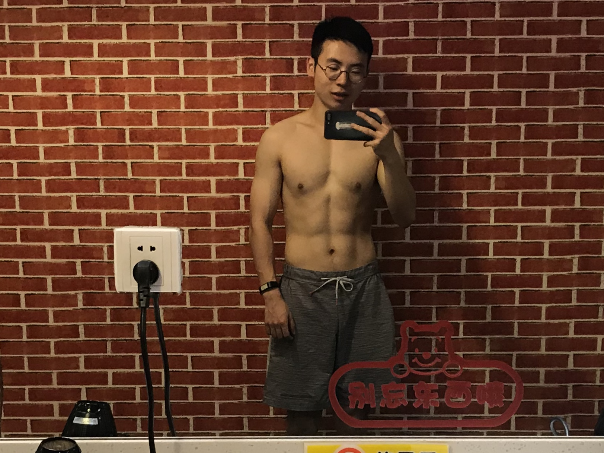

<!-- TOC depthFrom:1 depthTo:6 withLinks:1 updateOnSave:1 orderedList:0 -->

- [30 天刷脂记录](#30-天刷脂记录)
	- [计划开始前的数据(可能测得不太准)](#计划开始前的数据可能测得不太准)
		- [Day1](#day1)
			- [早餐](#早餐)
			- [午餐](#午餐)
			- [晚餐](#晚餐)
			- [活动](#活动)
		- [Day2](#day2)
			- [早餐](#早餐)
			- [午餐](#午餐)
			- [晚餐](#晚餐)
			- [活动](#活动)
		- [Day3](#day3)
			- [早餐](#早餐)
			- [午餐](#午餐)
			- [晚餐](#晚餐)
			- [活动](#活动)
		- [Day4](#day4)
			- [早餐](#早餐)
			- [午餐](#午餐)
			- [晚餐](#晚餐)
			- [活动](#活动)
		- [Day5](#day5)
			- [早餐](#早餐)
			- [午餐](#午餐)
			- [晚餐](#晚餐)
			- [活动](#活动)
		- [Day6](#day6)
			- [早餐](#早餐)
			- [午餐](#午餐)
			- [晚餐](#晚餐)
			- [活动](#活动)
		- [Day7](#day7)
			- [早餐](#早餐)
			- [午餐](#午餐)
			- [晚餐](#晚餐)
			- [活动](#活动)
		- [Day8 2017/04/16](#day8-20170416)
			- [早餐](#早餐)
			- [午餐](#午餐)
			- [晚餐](#晚餐)
			- [活动](#活动)
		- [Day9 2017/04/22](#day9-20170422)
			- [早餐](#早餐)
			- [午餐](#午餐)
			- [晚餐](#晚餐)
			- [活动](#活动)
		- [Day10 2017/04/23](#day10-20170423)
			- [早餐](#早餐)
			- [午餐](#午餐)
			- [晚餐](#晚餐)
			- [活动](#活动)
		- [Day11 2017/04/24](#day11-20170424)
			- [早餐](#早餐)
			- [午餐](#午餐)
			- [晚餐](#晚餐)
			- [活动](#活动)
		- [Day12 2017/04/25](#day12-20170425)
			- [早餐](#早餐)
			- [午餐](#午餐)
			- [晚餐](#晚餐)
			- [活动](#活动)
		- [Day13 2017/04/26](#day13-20170426)
			- [早餐](#早餐)
			- [午餐](#午餐)
			- [晚餐](#晚餐)
			- [活动](#活动)
		- [Day14 2017/04/27](#day14-20170427)
			- [早餐](#早餐)
			- [午餐](#午餐)
			- [晚餐](#晚餐)
			- [活动](#活动)
		- [Day15 2017/04/28](#day15-20170428)
			- [早餐](#早餐)
			- [午餐](#午餐)
			- [晚餐](#晚餐)
			- [活动](#活动)
		- [Day16 2017/05/02](#day16-20170502)
			- [早餐](#早餐)
			- [午餐](#午餐)
			- [晚餐](#晚餐)
			- [活动](#活动)
		- [Day17 2017/05/03](#day17-20170503)
			- [早餐](#早餐)
			- [午餐](#午餐)
			- [晚餐](#晚餐)
			- [活动](#活动)
		- [Day18 2017/05/04](#day18-20170504)
			- [早餐](#早餐)
			- [午餐](#午餐)
			- [晚餐](#晚餐)
			- [活动](#活动)
		- [Day19 2017/05/05](#day19-20170505)
			- [早餐](#早餐)
			- [午餐](#午餐)
			- [晚餐](#晚餐)
			- [活动](#活动)
		- [Day20 2017/05/06](#day20-20170506)
			- [早餐](#早餐)
			- [午餐](#午餐)
			- [晚餐](#晚餐)
			- [活动](#活动)
		- [Day21 2017/05/07](#day21-20170507)
			- [早餐](#早餐)
			- [午餐](#午餐)
			- [晚餐](#晚餐)
			- [活动](#活动)
		- [Day22 2017/05/08](#day22-20170508)
			- [早餐](#早餐)
			- [午餐](#午餐)
			- [晚餐](#晚餐)
			- [活动](#活动)
		- [Day23 2017/05/09](#day23-20170509)
			- [早餐](#早餐)
			- [午餐](#午餐)
			- [晚餐](#晚餐)
			- [活动](#活动)
		- [Day24 2017/05/10](#day24-20170510)
			- [早餐](#早餐)
			- [午餐](#午餐)
			- [晚餐](#晚餐)
			- [活动](#活动)
		- [Day25 2017/05/11](#day25-20170511)
			- [早餐](#早餐)
			- [午餐](#午餐)
			- [晚餐](#晚餐)
			- [活动](#活动)
		- [Day26 2017/05/12](#day26-20170512)
			- [早餐](#早餐)
			- [午餐](#午餐)
			- [晚餐](#晚餐)
			- [活动](#活动)
		- [Day27 2017/05/13](#day27-20170513)
			- [早餐](#早餐)
			- [午餐](#午餐)
			- [晚餐](#晚餐)
			- [活动](#活动)

<!-- /TOC -->

## 30 天刷脂记录
打算用30天的时间刷出腹肌，这个repo用来记录每天的饮食以及运动情况，并定期记录脂肪含量、体重等指标，时间从2018年4月9日开始，先立个flag，争取不被打脸。

### 计划开始前的数据(可能测得不太准)
* 身高： 170cm
* 体重： 60.9kg
* 体脂：14.4%
* 基础代谢： 1496 kcal
* 肌肉率： 81.2%

#### Day1
##### 早餐
蒙牛纯牛奶200ml、水煮蛋2个
##### 午餐
即食鸡胸肉 100g、粗粮面包1片、蒸荷兰豆90g、蒸金针菇90g
##### 晚餐
小紫薯两个、水煮蛋2个、蒸金针菇90g、肌肉科技乳清蛋白粉15g
##### 活动
爬楼机60min、器械上斜推胸15kg*2, 20kg\*2 ,25kg\*2, 27.5kg\*2，卷腹100个

#### Day2
##### 早餐
水果燕麦1勺、水煮蛋2个
##### 午餐
即食鸡胸肉 100g、粗粮面包1片、蒸荷兰豆90g、蒸金针菇90g
##### 晚餐
下午加餐，黑咖啡一杯
小紫薯两个、水煮蛋两个
晚上加餐酸奶一杯、蛋白粉15g
##### 活动
爬楼机60min、卷腹100个

#### Day3
##### 早餐
蒙牛纯牛奶240ml、水煮蛋2个
##### 午餐
即食鸡胸肉 100g、粗粮面包1片、蒸荷兰豆80g、蒸胡萝卜250g、金枪鱼蟹棒土豆泥115g
##### 晚餐
三文鱼生菜组合1盒、酸奶一杯、煮鸡蛋两个、蛋白粉半勺15g
##### 活动
爬楼机30min、肩部训练

#### Day4
##### 早餐
燕麦35g
##### 午餐
即食鸡胸肉 100g、粗粮面包1片、酸奶一杯
##### 晚餐
牛肉100g，小紫薯3个，蛋白粉30g
##### 活动
腿部训练1小时、腹部训练20min、
** 体脂降到13.2 **

#### Day5
##### 早餐
面包切片一片、蒙牛牛奶240ml、煮鸡蛋一个
##### 午餐
面包切片一片、酸奶一杯、牛肉100g
下午加餐樱桃番茄100g
##### 晚餐
鸡胸肉100g、橙子150g、小紫薯两个
##### 活动
练胸

#### Day6
##### 早餐
燕麦40g、橙子150g
##### 午餐
牛肉100g、金针菇100g、粗粮面包一片、橙子150g
##### 晚餐
米饭一小碗，渝是乎聚餐
##### 活动
周歇

#### Day7
##### 早餐
睡过去了
##### 午餐
白玉豆腐225g，粗粮面包1片，蒸荷兰豆80g，蒸金针菇100g
##### 晚餐
袋鼠先生牛肉100g，蒸荷兰豆60g，小紫薯两个
##### 活动
爬楼机一个小时，椭圆机30min

#### Day8 2017/04/16
##### 早餐
柯林黑咖啡2g，柯林白砂糖5g，水果燕麦40g
##### 午餐
粗粮面包一片，鸡胸肉100g，胡萝卜150g
##### 晚餐
袋鼠先生牛肉100g，小紫薯两个，加餐樱桃番茄266g，橙子两个
##### 活动
练胸90min

深圳四天放飞自我，不记了，测量指标为体重60kg，体脂率13%，惊奇的是这几天上涨的重量大部分是肌肉，可能前段时间蛋白吃太少了。

#### Day9 2017/04/22
##### 早餐
睡过去了
##### 午餐
牛肉100g，小紫薯2个，冠益乳酸奶100g
##### 晚餐
腹愁者蛋白棒一条48g，小紫薯两个，晚上加餐小番茄80g，酸奶一杯。
##### 活动
周歇

#### Day10 2017/04/23
##### 早餐
水煮蛋1个，燕麦30g
##### 午餐
鸡胸肉100g，小紫薯两个
##### 晚餐
腹愁者蛋白棒一条48g，小番茄100g，酸奶一杯。
##### 活动
练胸一个半小时

#### Day11 2017/04/24
##### 早餐
白玉黑豆豆浆220ml，鸡蛋两个
##### 午餐
鸡胸肉100g，小紫薯2个，蒸荷兰豆90g，蒸金针菇100g
##### 晚餐
腹愁者蛋白棒一条48g，小紫薯两个半，晚上加餐小番茄100g.
##### 活动
练背一个半小时

#### Day12 2017/04/25
##### 早餐
白玉黑豆豆浆220ml，鸡蛋一个，燕麦30g
##### 午餐
糙米饭100g，鸡胸肉100g，蒸胡萝卜100g
##### 晚餐
腹愁者蛋白棒一条48g
##### 活动
练肩一个半小时

#### Day13 2017/04/26
##### 早餐
纯牛奶220ml，鸡蛋一个，燕麦30g
##### 午餐
鸡胸肉100g，糙米饭100g，蒸胡萝卜100g
##### 晚餐
腹愁者蛋白棒一条48g，小紫薯两个，樱桃萝卜60g
##### 活动
练腿一个半小时

#### Day14 2017/04/27
##### 早餐
燕麦30g，鸡蛋两个
##### 午餐
大鸭梨聚餐，蟹黄豆腐，烤鸭半只，地锅排骨，水饺一份，两个吃完
##### 晚餐
腹愁者蛋白棒一条48g，酸奶一杯
##### 活动
跑步13km，练胸一个半小时

#### Day15 2017/04/28
##### 早餐
燕麦40g
##### 午餐
糙米饭100g，鸡胸肉100g
##### 晚餐
去上海路上带了点零食，不记
##### 活动

在上海三天正常饮食，无运动记录。

回来后数据指标：体重58.4kg、体脂12.7%

#### Day16 2017/05/02
##### 早餐
燕麦40g
##### 午餐
711西兰花花菜组合275g，金枪鱼蟹棒土豆泥115g
##### 晚餐
蛋白棒48g，胡萝卜100g，玉米半根，橙子两个
##### 活动
练肩90min

#### Day17 2017/05/03
##### 早餐
燕麦40g
##### 午餐
鸡胸肉100g，胡萝卜100g，豆角70g，白蘑菇80g，下午加餐橙子两个
##### 晚餐
豆角200g，白蘑菇80g，蛋白棒一根，酸奶一杯
##### 活动
练腿90min

#### Day18 2017/05/04
##### 早餐
燕麦40g
##### 午餐
鸡胸肉100g，胡萝卜100g，豆角70g，白蘑菇80g，下午加餐橙子两个
##### 晚餐
豆角200g，白蘑菇80g，蛋白棒一根，酸奶一杯
##### 活动
练腿90min

#### Day19 2017/05/05
##### 早餐
燕麦40g
##### 午餐
鸡胸肉100g，蛋白棒1根
##### 晚餐
渝是乎聚餐
##### 活动

#### Day20 2017/05/06
##### 早餐
睡过去了
##### 午餐
大鸭梨吃烤鸭（热量爆炸了...）
##### 晚餐
蛋白棒一根，小紫薯两个
##### 活动

#### Day21 2017/05/07
##### 早餐
水果燕麦 40g
##### 午餐
糙米饭100g、毛豆100g
##### 晚餐
毛豆100g、鸡胸肉100g、酸奶1杯，小土豆100g、紫薯1个
##### 活动
练胸

#### Day22 2017/05/08
##### 早餐
水果燕麦 40g
##### 午餐
糙米饭100g、鸡胸肉100g、酸奶1杯
##### 晚餐
虾仁130g、酸奶1杯、小土豆150g、紫薯1个、蓝莓小半盒
##### 活动
练背

#### Day23 2017/05/09
##### 早餐
水果燕麦 40g、全麦面包100g
##### 午餐
糙米饭100g、鸡胸肉100g、酸奶1杯、蒸金针菇100g
##### 晚餐
蛋白棒一根、小土豆150g、紫薯1个
##### 活动
练肩

#### Day24 2017/05/10
##### 早餐
水果燕麦 40g、全麦面包100g
##### 午餐
全麦面包100g、蛋白棒一条
##### 晚餐
蛋白棒一根、小土豆150g、紫薯1个
##### 活动
练腿

#### Day25 2017/05/11
##### 早餐
水果燕麦 40g
##### 午餐
蛋白棒一条，小土豆100g，紫薯一个
##### 晚餐
蛋白棒一根、小土豆150g、紫薯1个
##### 活动
练胸

#### Day26 2017/05/12
##### 早餐
##### 午餐
眉州卤肉饭、小笼牛肉、夏季新品某包子
##### 晚餐
蛋白棒一根、小土豆150g、紫薯1个
##### 活动

#### Day27 2017/05/13
##### 早餐
眉州早餐 油条 鸡蛋 南瓜粥
##### 午餐
局气聚餐
##### 晚餐
蛋白棒一根、小土豆150g、紫薯1个
##### 活动

老板召唤赶活，这一个礼拜没法正常锻炼和饮食了，于是提前结束，下一阶段准备开始增肌，来附一张这一个月的效果图。

半裸男预警

!!!
!!!
!!!
!!!
!!!
!!!
!!!
!!!
!!!
!!!
!!!
!!!
!!!
!!!
!!!
!!!
!!!
!!!

